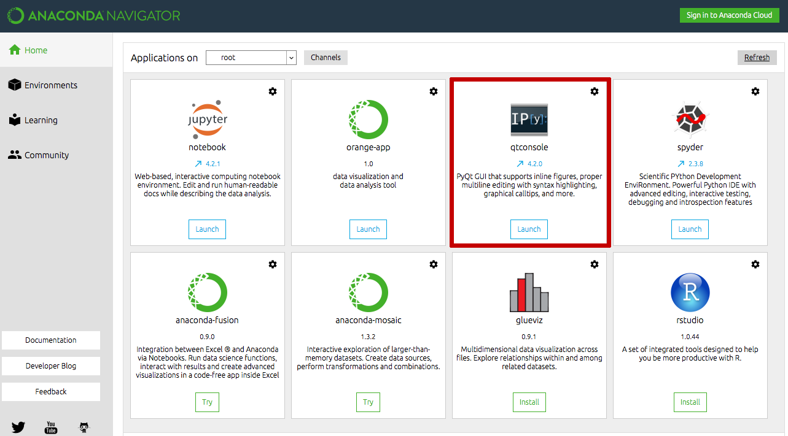

Installing Muesr
==================
This section provides an overview and guidance for installing Muesr on
various target platforms.

Prerequisites
-------------

You must have at least the following packages installed:

* Python 2.7, 3.1+      (http://www.python.org)
* Numpy 1.8.0+          (http://www.numpy.org)
* mulfc                 (http://github.com/bonfus/muLFC)

Other Python versions or Python implementations might work, but are
(currently) not officially tested or supported.

Additionally, you may consider installing the following packages or 
libraries to use *all* features of Muesr:

========= ========= =============================================== =========================================
Package   Version   Required for                                    Package URL
========= ========= =============================================== =========================================
YAML      >= 2.0.0  :mod:`muesr.i_o`                                http://pyyaml.org/
Spglib    >= 1.6    :mod:`muesr.utilities.symsearch`                http://atztogo.github.io/spglib/
Sympy     >= 1.0    :mod:`muesr.core.magmodel.SMM`                  http://sympy.org
appdirs   >= 1.1    :mod:`muesr.settings`               
XCrysDen  >= 1.0    :mod:`muesr.utilities.visualize`                http://www.xcrysden.org
VESTA     >= 3.4.0  :mod:`muesr.utilities.visualize`                http://jp-minerals.org/vesta/en/
========= ========= =============================================== =========================================

.. note::
   The muesr distribution ships with an internal version of appdirs which,
   however, may not be up to date.

System-wide installation
-------------------------

The installation with `pip` is as symple as ::

    pip install mulfc muesr

Optionally also install ::

    pip install spglib pyyaml

It is advisable to have a visualization tool, XCrysDen or VESTA. It must be already installed on your system. You can make muesr aware of the isntallation by running the following command :: 

   python -m  from muesr.settings import config\
   config.VESTAExec = "/path/to/VESTA"

where you must substitute to :title:`/path/to/` the actual path on your computer. 

Installation in virtualenv
--------------------------

Virtualenv offers a simple way of virtualizing the Python environment.
This means that you can have a separate collection of python packages 
for running Muesr (and install Muesr itself) without affecting the Python
installation system-wide.

To create the virualenv run in a terminal: ::

   python -m virtualenv muesr-env

and to activate the environment (Linux and OsX) ::

   cd muesr-env
   source bin/activate
   
now you can install mulfc and Muesr in the virtualenv with the same commands
reported above ::

    pip install mulfc muesr

A few notes for Windows users
-----------------------------

In order to install `muesr` on Windows you need a working python environment.
The best user experience is probably provided by Anaconda, which is a
complete Python distribution for scientific data analysis. The following steps assume 
that a working version of `Anaconda <https://www.anaconda.com/download/>`_ is available
on the target system.

Start Anaconda navigator and open an interactive python terminal:

From within the interactive terminal do: ::

    import pip
    pip.main("install mulfc spglib pyyaml muesr".split())

Now you are ready to go! Why not start with a look at the first paragraph
of the :ref:`tutorial` and then move directly to the Muesr :ref:`examples`?
