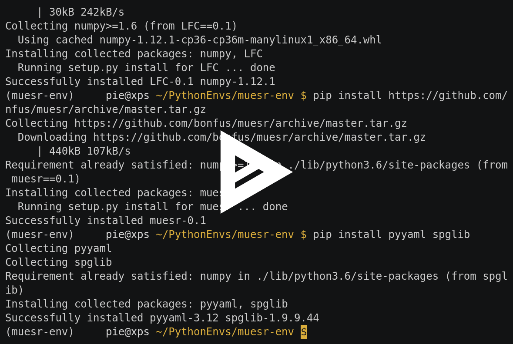

Installing Muesr
==================
This section provides an overview and guidance for installing Muesr on
various target platforms.

Prerequisites
-------------
Muesr relies on some 3rd party packages to be fully usable and to
provide you full access to all of its features.

You must have at least the following Python packages installed:

* Python 2.7, 3.1+      (http://www.python.org)
* Numpy 1.6.0+          (http://www.numpy.org)
* lfclib                (http://github.com/bonfus/muLFC)

Other Python versions or Python implementations might work, but are
(currently) not officially tested or supported.

.. note::
   Windows is likely to be supported with minor changes to the code.

Additionally, you will need the following packages and libraries to be
installed to use *all* features of Muesr:

========= ========= =============================================== =========================================
Package   Version   Required for                                    Package URL
========= ========= =============================================== =========================================
YAML      >= 2.0.0  :mod:`muesr.i_o.sampleIO`                       http://pyyaml.org/
Spglib    >= 1.6    :mod:`muesr.utilities.symsearch`                http://atztogo.github.io/spglib/
Sympy     >= 1.0    :mod:`muesr.core.magmodel.SMM`                  http://sympy.org
appdirs   >= 1.1    :mod:`muesr.settings`               
XCrysDen  >= 1.0    :mod:`muesr.i_o.xsf.xsf.show_cell` ,            http://www.xcrysden.org
                    :mod:`muesr.i_o.xsf.xsf.show_supercell`          
========= ========= =============================================== =========================================

.. note::
   The muesr distribution ships with a internal version of appdirs which,
   however, may not be up to date.

Compilation and system-wide installation
----------------------------------------

This is the hard way, and you'll need to be superuser.
Use git to clone Muesr and muLFC projects.
First install `muLFC` doing ::

    git clone https://github.com/bonfus/muLFC.git
    cd muLFC
    python setup.py install

In order to compile the python extension you also need the build tools appropriate
for your system (gcc on Linux, XCode on OS X, Visual Studio or gcc on Windows).
Next install `muesr` as ::

    git clone https://github.com/bonfus/muesr.git
    cd muesr

If you have all the prerequisites and you are in the muesr directory, type :: 

   pip install -r requirements.txt
   
and finally run ::

   python setup.py install

System-wide installation with wheels
----------------------------------------

It is possible to avoid the compilation of the C extension contained
in `lfclib` by directly installing the compiled python wheels.

A set of pre-compiled binaries is available in this repository:
https://packagecloud.io/muLFC/wheels

In order to select the correct package just do::

    python -c "import sys; print('LFC-0.1-cp{1}{2}-cp{1}{2}m-manylinux1_{0}.whl'.format('x86_64' if sys.maxsize > 2**32 else 'i686', sys.version_info[0], sys.version_info[1]))"

and install it with pip ::

    pip install LFC-0.1-cp**-cp**m-manylinux1_**.whl
    

.. note:: If you encounter an error like this
          "LFC-0.1-cp35-cp35m-manylinux1_x86_64.whl 
          is not a supported wheel on this platform" you probably
          choose a package that is not compatible with your python
          version or your system.

    
Finally install Muesr as ::

    pip install https://github.com/bonfus/muesr/archive/master.tar.gz

Installation in virtualenv
--------------------------

Virtualenv offers a simple way of virtualizing the Python environment.
This means that you can have a separate collection of python packages 
for running Muesr (and install Muesr itself) without affecting the Python
installation system-wide.

To install Muesr in a virtualenv, first make sure that the command `virtualenv`
is available on your system. If not, please check online what is the 
recommended way of installing virtualenv in your os.

To create the virualenv run in a terminal: ::

   virtualenv muesr-env

and to activate the environment (linux and OsX) ::

   cd muesr-env
   source bin/activate
   
now you can install LFC and Muesr in the virtualenv with the commands ::

   pip install https://github.com/bonfus/muLFC/archive/master.tar.gz
   pip install https://github.com/bonfus/muesr/archive/master.tar.gz
   
this will only provide the minimal dependencies. To have access to all 
Muesr functions you also need `spglib` and `PyYAML` ::

   pip install pyyaml spglib

   Follow the installation procedure in asciicast (you can copy/paste from the video!).

Now you are ready to go! Why not start with a look at the first paragraph
of the :ref:`tutorial` and then move directly to the Muesr :ref:`examples`?

