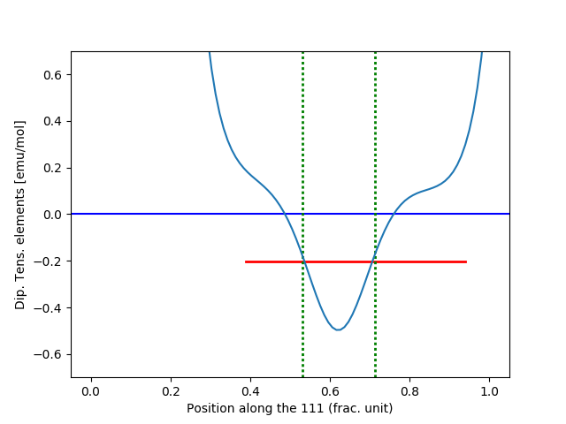
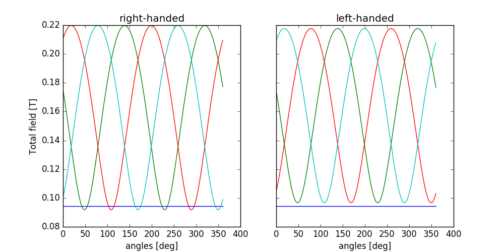
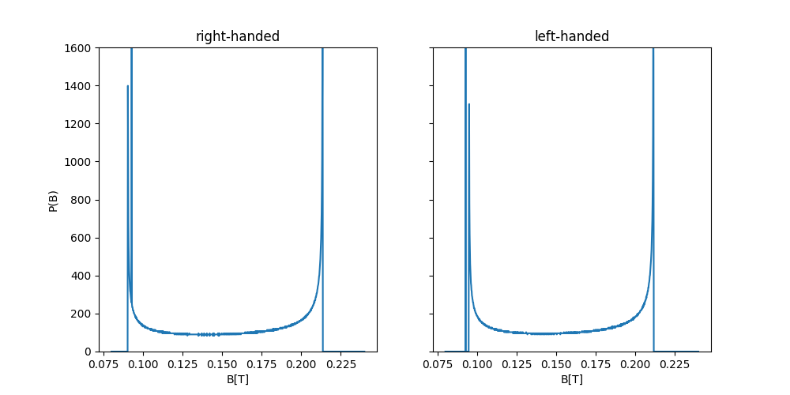
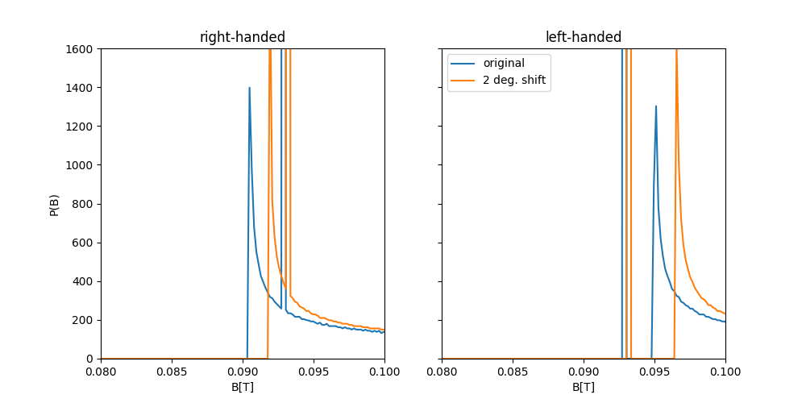

MnSi
====

This example will guide you through the experimental investigation conducted 
by Amato et al. and Dalmas de Réotier et. al reported in the following journal
articles [Amato2014]_, [DalmasdeReotier2016]_.

For the complete code see `run_example.py` in the `MnSi` the examples directory
of the muesr package (or open it `on github <https://github.com/bonfus/muesr/blob/master/examples/MnSi/run_example.py>`_).

.. note::  This is an advanced example. It is assumed that you already
           familiarized with Muesr by following one of the other examples
           or the tutorial.

Scientific background
----------------------

MnSi has a cubic lattice structure with lattice constant 4.558 Å. 
It has P213 (No. 198) space group symmetry and the Mn-ion occupy the 
position (0.138,0.138,0.138), while the Si-ion the position (0.845,0.845,0.845).

At T ~ 0 K, the magnetic structure of MnSi is characterized by spins forming a 
left-handed incommensurate helix with a propagation vector k≃0.036 Å^−1
in the [111] direction [5–7]. The static Mn moments ( ∼0.4μB for T→0 K)
point in a plane perpendicular to the propagation vector. 

Dipolar Tensor
--------------

Given the number of oscillations that are found in the experiment, only a Wyckoff site of type 4a is possible.
We therefore proceed by inspecting the dipolar tensor for all points the points of type 4a which happen
to be in the 111 (and equivalent) direction of the cubic cell.
As a first step, we will identify the number of parameters that characterize the dipolar tensor numerically by 
visually checking the dipolar tensor elements for all the equivalent sites. This can be done much more accurately
analytically but a numerical check can come in handy.

.. literalinclude:: ../examples/MnSi/run_example.py
   :lines: 37-79
   :emphasize-lines: 4, 7,11-18,21-24,27
   :lineno-start: 37
   :language: python

In line 40 we add one of the four symmetry equivalent positions for a 
muon in the `4a` Wyckoff site and we let the code find the other sites
in line 42 with the function `muon_find_equiv`.
In line 46 we define arbitrary small Fourier components which are used
to specify which atoms are magnetic (Mn in this case).
We finally add this sort of magnetic order to the sample description in 
lines 56-59 The value of the propagation vector given in line 58 can 
be omitted (resulting in 0 as default )as it is not used anywhere 
in this initial estimation of the dipolar tensor. 
The non-zero values of the dipolar tensor, shown at standard output, are
::

    Frac. muon position: 0.450 0.450 0.450
    Dipolar Tensor: 0.000 0.092 0.092
                    0.092 0.000 0.092
                    0.092 0.092 0.000
    
    
    Frac. muon position: 0.050 0.550 0.950
    Dipolar Tensor: 0.000 0.092 -0.092
                    0.092 -0.000 -0.092
                    -0.092 -0.092 0.000
    
    
    Frac. muon position: 0.550 0.950 0.050
    Dipolar Tensor: -0.000 -0.092 0.092
                    -0.092 0.000 -0.092
                    0.092 -0.092 0.000
    
    
    Frac. muon position: 0.950 0.050 0.550
    Dipolar Tensor: 0.000 -0.092 -0.092
                    -0.092 0.000 0.092
                    -0.092 0.092 -0.000
    
    

In order to compare with the experiment, we will evaluate the dipolar 
tensor for 100 values along the 111 direction. 

.. literalinclude:: ../examples/MnSi/run_example.py
   :lines: 84-98
   :emphasize-lines: 3,6
   :lineno-start: 84
   :language: python

Lines 99-110 produce the following figure: 

   
which is essentially what is reported in [Amato2014]_.

Local Fields
-------------

In order to calculate the local fields at the muon site in the helical state, we will first define the magnetic order and then evaluate the local fields with a optimized algorithm for incommensurate magnetic structures.

Let us first create a few useful variables for the definition of the Fourier components (FC).

.. literalinclude:: ../examples/MnSi/run_example.py
   :lines: 116-147
   :lineno-start: 116
   :language: python

We can now define both a left handed and a right handed helix.

.. literalinclude:: ../examples/MnSi/run_example.py
   :lines: 151-171
   :lineno-start: 151
   :language: python

We finally add the muon positions and the two magnetic orders with the 
commands

.. literalinclude:: ../examples/MnSi/run_example.py
   :lines: 177-190
   :lineno-start: 177
   :language: python

.. note:: When a new magnetic order is added, the index is automatically
          incremented and the new entry is immediately selected

In order to get the local contributions to the magnetic field at the 
muon site we use the function locfield function and specify the 'i' sum
type.

.. literalinclude:: ../examples/MnSi/run_example.py
   :lines: 192-197
   :lineno-start: 192
   :language: python

By default, the contact coupling is 0 for all sites. In order to have a 
contact term different from 0 we have to set the parameter ACont
for all the muon sites that we defined.

.. literalinclude:: ../examples/MnSi/run_example.py
   :lines: 200-202
   :lineno-start: 200
   :language: python

The lines 205-2624produce the following pictures:

   

Interestingly, left-handed and right-handed orders produce different local field. This is due to the lack of inversion symmetry.

The phase between Mn atoms in the unit cell
-------------------------------------------

Dalmas De and Reotier colleagues pointed out that the complete description
of the spiral phase requires three additional degrees of freedom: the two angles 
describing the misalignmente between the rotation plane of the Mn moments
and the plane perpendicular to the propagation vector :math:`k` and the
phase between the helices in the Mn sites belonging to the two crystallographic 
orbits (see [DalmasdeReotier2016]_).
This last parameter strongly influence the results.

Here we define a phase shift of :math:`\phi=2` degrees as reported in the article 
mentioned above.

.. literalinclude:: ../examples/MnSi/run_example.py
   :lines: 293-311
   :lineno-start: 293
   :emphasize-lines: 1,11
   :language: python

Repeating the same procedure discussed above leads to the following 
comparison between the magnetic structures with :math:`\phi=0` (blue) and 
and :math:`\phi=2` deg (orange).

Bibliography
------------

.. [Amato2014] Phys. Rev. B 89, 184425
.. [DalmasdeReotier2016] Phys. Rev. B 93, 144419
