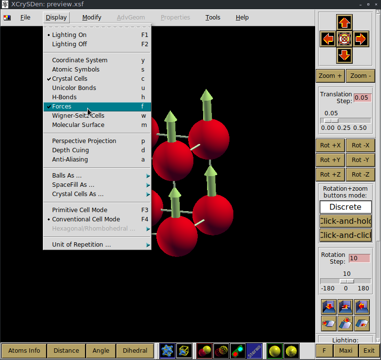

Tutorial
========

This tutorial describes how to use the :py:mod:`~muesr` API to obtained
the local magnetic field at a specific interstitial muon site in a magnetic
sample.

To proficiently use :py:mod:`~muesr` a basic knowledge of python is
strongly suggested. There are plenty of tutorial out there in the web, pick
one and get familiar with the basic python syntax before going forward.

First steps with muesr
---------------------------

Definig the sample
+++++++++++++++++++++++++++++++++

The fundamental component of Muesr is the :py:class:`~muesr.core.sample.Sample` object.
You can import and initialize it like this:

.. code-block:: python
    
    >>> from muesr.core import Sample
    >>>
    >>> mysample = Sample()

Specifying the lattice structure
++++++++++++++++++++++++++++++++++++

The first thing that must be defined in a sample object is the lattice structure
and the atomic positions. Muesr uses a custom version of the ASE :class:`~muesr.core.atoms.Atoms` class
to do so. 
The following code defines and add the the lattice structure of simple cubic Iron
to the sample object:

.. code-block:: python
    
    >>> import numpy
    >>> from muesr.core.atoms import Atoms
    >>> 
    >>> atms = Atoms(symbols=['Fe'], scaled_positions=[[0.,0.,0.]], cell=numpy.diag([3.,3.,3.]), pbc=True)
    >>> 
    >>> mysample.cell = atms
    
However this procedure is quite tedious and error prone so it is much better to use 
builtin functions to parse crystallographic files.

At the moment muesr can parse crystallographic data from CIF (cif) files
and XCrysDen (xsf) files.
Here's an example:

.. code-block:: python
    
    >>> # load data from XCrysden *.xsf file
    >>> from muesr.i_o import load_xsf
    >>> 
    >>> load_xsf(mysample, "/path/to/file.xsf")
    >>> 
    >>> 
    >>> # load data from *.cif file
    >>> from muesr.i_o import load_cif
    >>> 
    >>> load_cif(mysample, "/path/to/file.cif")
    >>> 
    >>> 

The :py:func:`~muesr.i_o.cif.cif.load_cif` function will also load symmetry information. 
Please note that **only a single lattice structure at a time** can be
defined so each load function will remove the previous lattice structure
definition.

Setting muon positions
++++++++++++++++++++++

When the lattice structure is defined it is possible to specify the
muon position and the magnetic orders.

To specify the muon position, just do:

.. code-block:: python
    
    >>> mysample.add_muon([0.1,0,0])
    
positions are assumed to be in fractional coordinates. If Cartesian coordinates
are needed, they can be specified as

.. code-block:: python
    
    >>> mysample.add_muon([0.3,0,0], cartesian=True)

You can verify that the two positions are equivalent by printing them with
the command

.. code-block:: python
    
    >>> print(mysample.muons)
    [array([ 0.1,  0. ,  0. ]), array([ 0.1,  0. ,  0. ])]

If symmetry information are present in the sample definition, it
symmetry equivalent muon sites can be obtained.
This can be done with the utility function :py:func:`~muesr.utilities.muon.muon_find_equiv`.
In our case we did not load any symmetry information so the 
following command will raise an error.
You can check that by doing

.. code-block:: python
    
    >>> from muesr.utilities import muon_find_equiv
    >>> muon_find_equiv(mysample)
    [...]
    SymmetryError: Symmetry is not defined.
    

Defining a magnetic structure
++++++++++++++++++++++++++++++

The next step is the definition of a magnetic structure. To do so one 
must specify the propagation vector and the Fourier components and, 
optionally, the phases.
A quick way to do that is using the helper function :py:func:`~muesr.utilities.ms.mago_add` from
:py:mod:`~muesr.utilities.ms`. 

.. code-block:: python
    
    >>> from muesr.utilities.ms import mago_add
    >>> 
    >>> mago_add(mysample)
    
You will be asked the propagation vector and the Fourier coefficients
for the specified atomic symbol. By default the Fourier components are
specified in **Cartesian** coordinates. You can use the keyword argument
`inputConvention` to change this behavior (see :py:func:`~muesr.utilities.ms.mago_add`
documentation for more info).
Here's an example::

     >>> mago_add(a)
        Propagation vector (w.r.t. conv. rec. cell): 0 0 0
        Magnetic moments in Bohr magnetons and Cartesian coordinates.
        Which atom? (enter for all)Fe
        Lattice vectors:
            a    3.000000000000000    0.000000000000000    0.000000000000000
            b    0.000000000000000    3.000000000000000    0.000000000000000
            c    0.000000000000000    0.000000000000000    3.000000000000000
        Atomic positions (fractional):
            1 Fe  0.00000000000000  0.00000000000000  0.00000000000000  63.546
        FC for atom 1 Fe (3 real, [3 imag]): 0 0 1
        
The same can be achieved without interactive input like this:

.. code-block:: python
    
    >>> mysample.new_mm()
    >>> mysample.mm.k = numpy.array([ 0.,  0.,  0.])
    >>> mysample.mm.fc = numpy.array([[ 0.+0.j,  0.+0.j,  1.+0.j]])
    >>> mysample.mm.desc = "FM m//c"

.. note::
   In this method each atom must have a Fourier component! For a 8 atoms
   unit cell the numpy array specifying the value must be a 8 x 3 complex
   array!
   

It is possible to specify multiple magnetic structure for the same lattice
structure. **Each time a new magnetic structure is added to the sample
object it is immediately selected for the later operations**.
The currently selected magnetic order can be checked with the following
command:

.. code-block:: python
    
    >>> print(mysample)
    Sample status: 
    
    Crystal structure:           Yes
    Magnetic structure:          Yes
    Muon position(s):            2 site(s)
    Symmetry data:               No
    
    Magnetic orders available ('*' means selected)
    
     Idx | Sel | Desc. 
      0  |     | No title
      1  |  *  | FM m//c

Checking the magnetic structure
+++++++++++++++++++++++++++++++

The magnetic structures already defined can be visualized with the XCrysDen
software.

.. code-block:: python

    >>> from muesr.utilities import show_structure
    >>> show_structure(mysample)

the interactive session will block until XCrysDen is in execution.
To show the local moments on Iron atoms press the 'f' key or 'Display -> Forces'.

To procede with the tutorial close the XCrysDen Window.

Evaluating the local field
++++++++++++++++++++++++++

Once you are done with the definition of the sample details it's time to
crunch some numbers!
To evaluate the local fields at the muon site :py:mod:`~muesr` uses a 
python extension written in C in order to get decent performances.
You can load a simple wrapper to the extension as providing local fields
with the following command 

.. code-block:: python

    >>> from muesr.engines.clfc import locfield

A detailed description of the possible computations is given in the 
muLFC documentation.

Let's go straight to the local field evaluation which is obtained by 
running the command: 

.. code-block:: python

    >>> results = locfield(mysample, 'sum', [30, 30, 30] , 40)

The first argument is just the sample object that was just defined.
The second and third argument respectively specify that
a simple *sum* of all magnetic moments should be performed using a supercell
obtained replicating  *30x30x30 times* the unit cell along the lattice vectors.
The fourth argument is the radius of the Lorentz sphere considered.
All magnetic moments outside the Lorentz sphere are ignored and
the muon is automatically placed in the center of the supercell.

.. note::
   To get an estimate of the largest radius that you can use to avoid 
   sampling outside the supercell size you can use the python
   function `find_largest_sphere` in the LFC python package.

.. warning::
   If the Lorentz sphere does not fit into the supercell, the results 
   obtained with this function are not accurate!

The `results` variable now contains a list of 
:py:class:`~muesr.core.magmodel.LocalField` objects.
However, if you print the `results` variable you'll see something that looks like
a numpy array: 

.. code-block:: python

    >>> print(results)
    [array([  3.83028907e-18,  -3.37919319e-18,  -3.42111893e+01]),
     array([  3.83028907e-18,  -3.37919319e-18,  -3.42111893e+01])]

    
these are the **total field** for the muon positions and the magnetic structure 
defined above. To access the various components you do: 

.. code-block:: python

    >>> results[0].Lorentz
    array([ 0.        ,  0.        ,  0.14355877])
    
    >>> results[0].Dipolar
    array([  3.83028907e-18,  -3.37919319e-18,  -3.43547481e+01])
    
    >>> results[0].Contact
    array([ 0.,  0.,  0.])

And you are done! Remember that all results are in Tesla units.

Saving for later use
++++++++++++++++++++

The current sample definition can be stored in a file with the following
command:

.. code-block:: python

    >>> from muesr.i_o import save_sample
    >>> save_sample(mysample, '/path/to/mysample.yaml')
    
and later loaded with 

.. code-block:: python

    >>> from muesr.i_o import load_sample
    >>> mysample_again = load_sample('/path/to/mysample.yaml')
    

